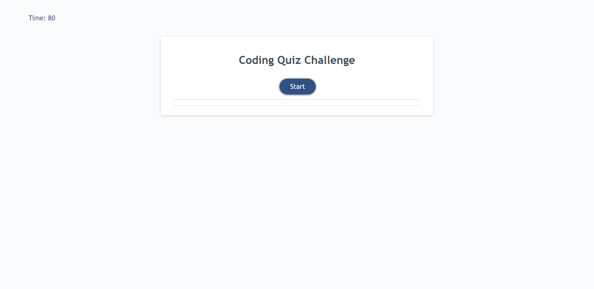
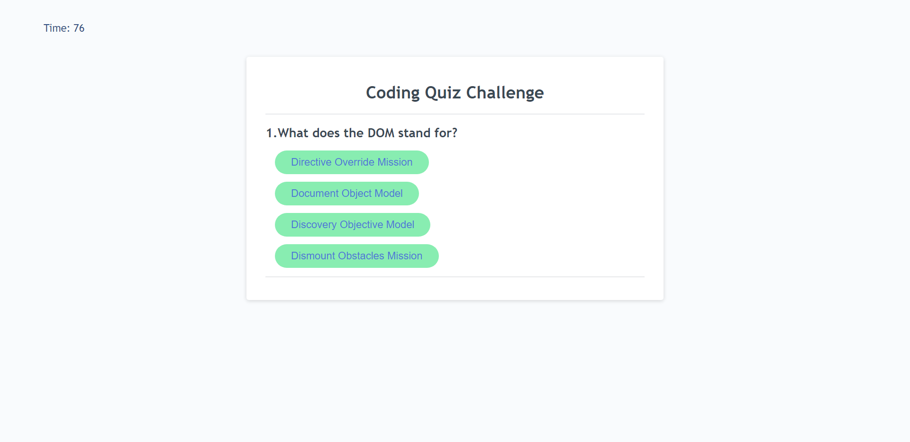
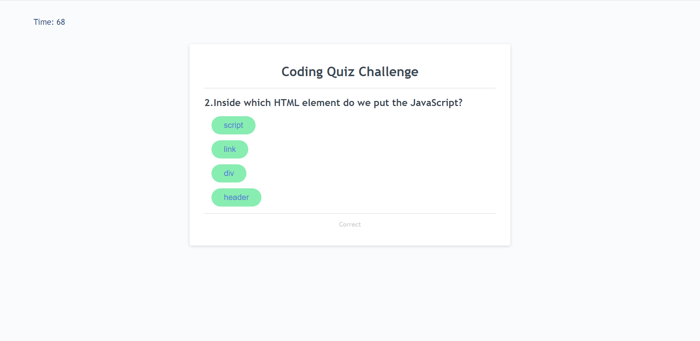
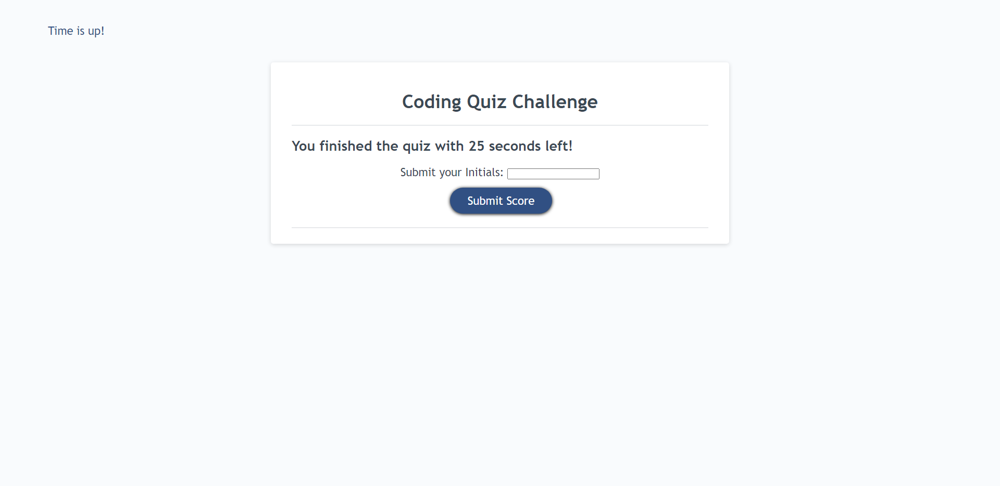
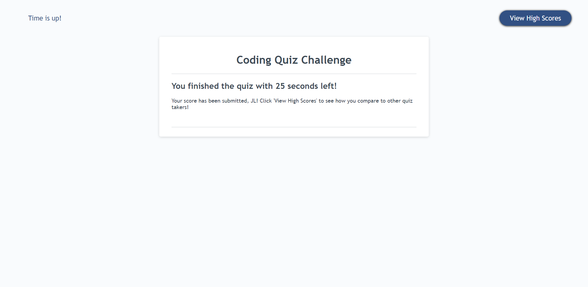
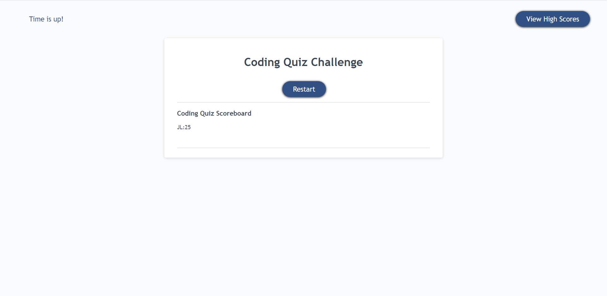

# JavaScript_Quiz

## Description

When creating this project, I set out to create a helpful JavaScript quiz to allow users to challenge their knowledge of the language model. By completing this assignment, I learned *a lot* about variable arrays, and how JavaScript functions work.

## Installation

N/A

## Usage

You can access the website here: https://jeslocascio.github.io/JavaScript_Quiz/

To use this page, simply click the "Start" button on the screen, as seen below:

After you click the button, the quiz will begin, and a timer will start ticking. This is demonstrated here:
 

Once you click on an answer, the screen will tell you if that answer was correct or incorrect:

After you answer all the questions, or run out of time on the timer, you will be sent to the following Score Submission screen:

Once you set your initials into the text box, you will be shown the following success screen, and asked to click on the "View High Scores" button: 

On the "View High Scores" page, you will see everyones score who has completed the quiz, and be able to restart to try for a better score:

## Credits

The YouTube video "How To Make Quiz App Using JavaScript | Build Quiz App With HTML CSS & JavaScript" by *GreatStack* helped a lot in building a foundation for the quiz.

## License

MIT License

Please refer to the LICENSE in the repo for more information.

## Features

Timer element

Quiz questions

Correct or Incorrect response checker

Submission text box

Scoreboard